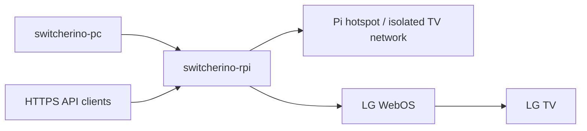

# switcherino-rpi

Raspberry Pi Zero W HTTPS bridge for controlling an LG TV over WebOS.

`switcherino-rpi` is the TV side of a two-part living-room gaming setup:

- the Raspberry Pi knows how to control the TV
- the PC knows how to switch its own display and audio state
- both can work together so a single action moves the setup from a normal desktop / media state to a gaming-on-TV state

This repository focuses on the Raspberry Pi bridge: a local HTTPS API, LG WebOS pairing and control, Wake-on-LAN support, and an optional Wi-Fi hotspot model that keeps the TV off the main network.

## Why This Exists

The original goal was to automate TV source switching over HDMI-CEC.

In practice, that broke down because LG does not allow switching to arbitrary inputs over CEC. WebOS turned out to be much more dependable for source switching, power control, and reading the TV state.

The setup may look a little overkill, but it solves the problem with some specifics criterias :

- the TV should not be able to access the normal local network
- the TV should be even less able to access the internet
- the Raspberry Pi can still expose a safe local control API to trusted clients
- the API can wake the TV, switch to the gaming HDMI input, and optionally synchronize volume settings

This could potentially be simplified with router-level network configuration, but the point here is to keep the solution self-contained and independent.

## The Full Setup

If you use the complete system, both repositories go together:

- [`switcherino-rpi`](https://github.com/alecs297/switcherino-rpi): Raspberry Pi HTTPS bridge for LG WebOS TV control, source switching, optional wake flow, and optional TV hotspot isolation
- [`switcherino-pc`](https://github.com/alecs297/switcherino-pc): Windows companion app that switches display/audio profiles, launches Steam Big Picture, and calls the Pi bridge

High-level responsibilities:

| Component | Responsibility |
| --- | --- |
| `switcherino-rpi` | Control the TV over WebOS, switch HDMI source, optionally wake the TV with Wake-on-LAN, isolate TV networking through the Pi |
| `switcherino-pc` | Detect trigger, expose local API, switch Windows display/audio profile, launch/monitor Steam Big Picture, roll back on exit |

## What This Project Does

This project turns a Raspberry Pi into a small control bridge for an LG TV:

- the Pi runs a local HTTPS API
- the Pi joins your normal Wi-Fi network
- the Pi also exposes a second Wi-Fi hotspot
- the TV connects to that hotspot
- the API then talks to the TV through LG WebOS

Typical usage:

1. a client calls the Pi API
2. the API wakes the TV if necessary
3. the API connects to the TV over WebOS
4. the API changes source, powers the TV off, or switches between normal mode and gaming mode
5. when enabled, the API also applies the configured target volume for that mode

The app pairs once with the TV and stores credentials in `pairing.json`.

## End-To-End Flow

Typical gaming-mode flow when used with the companion PC app:

1. `switcherino-pc` decides to enter gaming mode
2. it calls `POST /tv/action` on the Raspberry Pi bridge
3. `switcherino-rpi` wakes the TV if needed
4. the Pi switches the TV to `pc_target`
5. the Pi optionally applies `game_mode_volume`
6. later, when the PC leaves gaming mode, it calls the Pi again
7. the Pi switches the TV back to `default_target`
8. the Pi optionally applies `default_mode_volume`



## Hardware Requirements

This project targets:

- a Raspberry Pi Zero W
- an LG TV running WebOS

Technically, the web app could run on something else, but the intended target is a Raspberry Pi Zero W.

Important note: do not rely on the TV USB ports to power the Pi, because most TVs cut USB power at some point during sleep.

Other importantish note : for now, the `turn_on` feature relies on Wake-on-LAN because WebOS alone cannot power the TV on.

## Features

- local HTTPS API with Bearer-token authentication
- LG WebOS TV pairing and control
- TV source switching by source id or label
- mode-oriented actions for `switch_to_game_mode` and `switch_to_default_mode`
- optional volume synchronization for gaming mode and default mode
- Wake-on-LAN support for turning the TV on
- optional configurable fallback `turn_on_target`
- self-hosted certificate endpoint at `GET /certs`
- Pi hotspot setup for a TV-only Wi-Fi segment
- helper scripts for pairing, certificates, Wake-on-LAN validation, hotspot setup, and systemd service installation
- FastAPI interactive docs at `/docs` and `/redoc`

## Relationship With `switcherino-pc`

The Pi project is useful on its own if you just want an HTTPS bridge for LG WebOS control from another client.

When paired with [`switcherino-pc`](https://github.com/alecs297/switcherino-pc), it becomes the TV-orchestration half of the full setup.

What the companion PC project adds:

- a Windows tray app
- a local PC-side HTTPS API
- controller long-press detection
- Windows display topology switching
- Windows audio endpoint and volume switching
- Steam Big Picture launch and automatic rollback

The PC app typically calls the Pi on:

- `GET /tv/status`
- `POST /tv/action`

The Pi app provides:

- `switch_to_game_mode` to move the TV to the gaming input
- `switch_to_default_mode` to restore the normal source
- `turn_on`, `turn_off`, and `change_source` for TV-side workflows

## TV Settings Checklist

Before pairing the TV with the Pi, review these settings on the TV itself.

Recommended settings:

- disable `Energy Saving` or `Energy Saving Step`
- enable `TV On With Mobile`
- inside `TV On With Mobile`, enable `Turn on via Wi-Fi`

Exact LG menu names vary slightly by webOS version.

Common paths:

- webOS 23: `Settings` -> `General` -> `External Devices` -> `TV On With Mobile` -> `Turn on via Wi-Fi`
- webOS 22 / webOS 6.0: `Settings` -> `General` -> `Devices` -> `External Devices` -> `TV On With Mobile` -> `Turn on via Wi-Fi`
- older models may expose a similar option under `Mobile TV On` or `Mobile Connection Management`

For power saving:

- many models use `Settings` -> `Picture` -> `Energy Saving` -> `Off`
- some newer models expose `Settings` -> `General` -> `OLED Care` -> `Device Self Care` -> `Energy Saving Step` -> `Off`

## Installation

### 1. Set up the Pi

Flash Raspberry Pi OS Lite (32-bit) to the microSD card with Raspberry Pi Imager. The headless version is recommended.

Follow the Raspberry Pi getting started guide [here](https://www.raspberrypi.com/documentation/computers/getting-started.html) and make sure the Pi has:

- SSH access
- Internet access
- a working Wi-Fi client connection on `wlan0`
- a separate stable power supply

### 2. Install system packages

```bash
sudo apt update
sudo apt install -y python3 python3-venv python3-pip git openssl hostapd dnsmasq iw
```

### 3. Disable the default `hostapd` and `dnsmasq` services

Those packages are used directly by the custom hotspot script, not via their stock services.

```bash
sudo systemctl disable --now hostapd.service
sudo systemctl disable --now dnsmasq.service
sudo systemctl mask hostapd.service
sudo systemctl mask dnsmasq.service
```

### 4. Clone the repository and install Python dependencies

```bash
cd ~
git clone https://github.com/alecs297/switcherino-rpi
cd switcherino-rpi
python3 -m venv venv
source venv/bin/activate
python3 -m pip install -r requirements.txt
```

Runtime dependencies are primarily:

- `fastapi` + `uvicorn` for the HTTPS API
- `pydantic` for request validation
- `pywebostv` for LG WebOS control

### 5. Configure and install the hotspot service

Edit [`scripts/setup_wifi.sh`](./scripts/setup_wifi.sh) and adapt at least:

```bash
SSID="PiHotspot"
PASSPHRASE="12345678"
```

You may also want to review:

- `STA_IF`
- `AP_IF`
- `AP_IP_CIDR`

Notable behavior of the hotspot script:

- it expects to run as root
- it uses `wlan0` as the station interface by default
- it creates a virtual AP interface named `wlan0_ap`
- if `wlan0` is already connected, it reuses the current Wi-Fi channel
- it writes `hostapd` and `dnsmasq` config files under `/etc`

Install the hotspot script as a one-shot systemd service:

```bash
sudo cp scripts/setup_wifi.sh /usr/local/bin/setup_wifi.sh
sudo chmod +x /usr/local/bin/setup_wifi.sh
sudo bash -c 'cat > /etc/systemd/system/pihotspot.service <<EOF
[Unit]
Description=Dynamic Pi Hotspot (client + AP)
After=network-online.target
Wants=network-online.target

[Service]
Type=oneshot
ExecStart=/usr/local/bin/setup_wifi.sh
RemainAfterExit=yes

[Install]
WantedBy=multi-user.target
EOF

systemctl daemon-reload
systemctl enable pihotspot.service'
```

Test it manually:

```bash
sudo /usr/local/bin/setup_wifi.sh
```

If the script succeeds, the TV should see the hotspot in its Wi-Fi list and be able to join it. The hotspot will be set up automatically on every Pi boot.

### 6. Create the application config

Run the app once:

```bash
python3 app.py
```

On first start, this creates `config.json`, prints the generated admin key, and exits.

Review `config.json` and adjust the important fields:

```json
{
  "host": "0.0.0.0",
  "port": 8443,
  "api_key": "generated-secret",
  "default_target": "HDMI_1",
  "pc_target": "HDMI_2",
  "change_volume_on_game_mode": false,
  "change_volume_on_default_mode": false,
  "game_mode_volume": 15,
  "default_mode_volume": 0,
  "tv_mac": "44:27:45:22:ab:3e",
  "wake_wait_seconds": 8.0,
  "wake_attempts": 3,
  "wake_attempt_interval_seconds": 2.0,
  "wake_connect_timeout_seconds": 20.0,
  "turn_on_target": "",
  "wake_broadcast_addresses": [],
  "wake_ports": [9, 7]
}
```

Configuration reference:

| Key | Purpose |
| --- | --- |
| `host` | Bind address for the FastAPI server |
| `port` | HTTPS port exposed by the API |
| `api_key` | Bearer token used to authenticate protected endpoints |
| `default_target` | Source id or unique label used by `switch_to_default_mode` |
| `pc_target` | Source id or unique label used by `switch_to_game_mode` |
| `change_volume_on_game_mode` | If `true`, `switch_to_game_mode` sets the TV volume |
| `change_volume_on_default_mode` | If `true`, `switch_to_default_mode` sets the TV volume |
| `game_mode_volume` | Target volume applied by `switch_to_game_mode` |
| `default_mode_volume` | Target volume applied by `switch_to_default_mode` |
| `tv_mac` | MAC address used for Wake-on-LAN |
| `wake_wait_seconds` | Fixed wait after sending WOL packets before probing WebOS again |
| `wake_attempts` | Number of WOL rounds sent by the API |
| `wake_attempt_interval_seconds` | Delay between WOL rounds |
| `wake_connect_timeout_seconds` | How long the API waits for the TV to become reachable again |
| `turn_on_target` | Optional fallback target used by `turn_on` if the request body does not provide one |
| `wake_broadcast_addresses` | Optional list of extra broadcast addresses for WOL |
| `wake_ports` | UDP ports used for WOL packets |
| `cert_file` | Path to the TLS certificate used by the API |
| `key_file` | Path to the TLS private key used by the API |
| `suggested_base_url` | Convenience value returned by `/certs` |

Important configuration notes:

- prefer WebOS source ids such as `HDMI_1` and `HDMI_2` over labels, because labels may not be unique
- `switch_to_game_mode` uses `pc_target`
- `switch_to_default_mode` uses `default_target`
- `game_mode_volume` and `default_mode_volume` are target volumes from `0` to `100`
- protected endpoints use `Authorization: Bearer <api_key>`
- if `tv_mac` is empty, `turn_on` returns an error by design
- on startup, legacy `admin_key` is migrated in memory to `api_key` if present

### 7. Generate HTTPS certificates

```bash
./scripts/gen_certs.sh
```

The certificate helper:

- writes files under `certs/`
- requires an IP address
- lets you optionally override the default hostname
- generates a self-signed certificate valid for both the chosen domain and IP

It creates:

- `certs/server.crt`
- `certs/server.key`
- `certs/openssl-san.cnf`

### 8. Pair the Pi with the TV

Make sure the TV is connected to the Pi hotspot, then run:

```bash
python3 scripts/pairing.py
```

The script will:

- ask whether the TV is already connected to the hotspot
- ask for the TV IP, or try to discover it automatically if left blank
- initiate WebOS pairing
- ask for the code shown on the TV if needed
- save everything required for future connections in `pairing.json`

If auto-discovery finds more than one TV, rerun the script and enter the IP manually.

The generated `pairing.json` is required by `app.py` and is intentionally ignored by git.

### 9. Verify or debug Wake-on-LAN if needed

The helper script can inspect and test the WOL setup:

```bash
python3 scripts/wol.py extract
python3 scripts/wol.py test --debug
python3 scripts/wol.py all
```

It can:

- read the default `config.json` and `pairing.json`
- use custom files with `--config` and `--pairing`
- override values directly with `--mac`, `--host`, `--broadcast`, `--port`, `--attempts`, and `--interval`

Examples:

```bash
python3 scripts/wol.py extract
python3 scripts/wol.py test --debug
python3 scripts/wol.py all --mac 44:27:45:22:ab:3e --host 192.168.50.46 --broadcast 192.168.50.255 --port 9
python3 scripts/wol.py test --config /path/to/other-config.json --pairing /path/to/other-pairing.json
```

Wake-on-LAN notes:

- the API always tries `255.255.255.255`
- it also derives the `/24` broadcast address from the TV IP stored in `pairing.json`
- you can force extra addresses with `wake_broadcast_addresses`

### 10. Manually test the API (optionnal)

```bash
python3 app.py
```

### 11. Install the API as a systemd service

A helper script already exists to register the app as a service and start it at boot:

```bash
sudo ./scripts/gen_service.sh
```

The script:

- requires `sudo`
- validates the project directory and the virtualenv Python path
- prompts for the service name, runtime user, working directory, and `ExecStart`
- writes a unit under `/etc/systemd/system`
- enables the service at boot
- starts it immediately
- restarts it automatically on failure
- orders it after `network-online.target` and `pihotspot.service`

The default service name is:

- `webos-tv-api`

To inspect the service:

```bash
systemctl status webos-tv-api.service
```

To follow logs:

```bash
journalctl -u webos-tv-api.service -f
```

To see recent logs:

```bash
journalctl -u webos-tv-api.service -n 200 --no-pager
```

To remove the service:

```bash
sudo ./scripts/remove_service.sh
```

## API

Swagger documentation is exposed through FastAPI at:

- `/docs`
- `/redoc`

Main routes:

- `GET /certs`
- `GET /tv/status`
- `POST /tv/action`

Protected endpoints use:

```text
Authorization: Bearer YOUR_API_KEY
```

### `GET /certs`

Returns certificate material that local clients can use to trust or pin the Pi API, including:

- `suggested_base_url`
- the certificate SHA-256 fingerprint
- the PEM certificate text

### `GET /tv/status`

Returns the current TV status, including:

- TV host
- whether the connection is secure
- system information
- current app
- current volume state
- discovered sources
- `default_target`
- `pc_target`
- whether game-mode and default-mode volume changes are enabled

Example response shape:

```json
{
  "ok": true,
  "status": {
    "host": "192.168.50.46",
    "secure": true,
    "system": {
      "product_name": "webOSTV 24",
      "model_name": "HE_DTV_W24G_AFABATAA",
      "major_ver": "23",
      "minor_ver": "20.39",
      "device_id": "f8:01:b4:d2:c6:5a"
    },
    "current_app": "com.webos.app.hdmi4",
    "volume": {
      "volumeStatus": {
        "volume": 13,
        "muteStatus": false,
        "soundOutput": "tv_speaker"
      }
    },
    "sources": [
      {
        "id": "HDMI_1",
        "label": "PC",
        "connected": true
      },
      {
        "id": "HDMI_2",
        "label": "PC",
        "connected": true
      },
      {
        "id": "HDMI_4",
        "label": "Apple OTT",
        "connected": true
      }
    ],
    "default_target": "HDMI_1",
    "pc_target": "HDMI_2",
    "change_volume_on_game_mode": false,
    "change_volume_on_default_mode": false
  }
}
```

Important interpretation notes:

- `sources[*].id` is the safest value to use in `config.json` and in `change_source`
- `sources[*].label` may be duplicated; for example both `HDMI_1` and `HDMI_2` can be labeled `PC`
- `current_app` usually reflects the active HDMI app, such as `com.webos.app.hdmi4`
- `raw` contains extra LG metadata such as `appId`, `port`, signal presence, and EDID-derived device information

### `POST /tv/action`

Supported actions:

- `turn_on`
- `turn_off`
- `change_source`
- `switch_to_game_mode` (`Enter gaming mode`)
- `switch_to_default_mode` (`Return to default mode`)

Action behavior:

- `change_source` switches to a source identified by id or label and tries to wake the TV first if needed
- `switch_to_game_mode` switches to `pc_target` and can set the TV volume to `game_mode_volume`
- `switch_to_default_mode` switches to `default_target` and can set the TV volume to `default_mode_volume`
- `turn_off` powers the TV off via WebOS
- `turn_on` sends Wake-on-LAN packets, waits for WebOS to come back, and can optionally switch to a target afterward

Target behavior:

- `change_source` accepts a source id, a label, or configured aliases such as `default` and `pc`
- `turn_on` can accept a request target
- if `turn_on` does not receive a target, it uses `turn_on_target` when configured
- `switch_to_game_mode` and `switch_to_default_mode` ignore request targets and always use their configured targets

Example request:

```bash
curl -k \
  -H "Authorization: Bearer YOUR_API_KEY" \
  -H "Content-Type: application/json" \
  -d '{"action":"change_source","target":"HDMI_1"}' \
  https://PI_IP:8443/tv/action
```

## Runtime Behavior

Entering game mode currently does the following:

1. connect to the TV, waking it first if needed
2. switch to `pc_target`
3. optionally restore `game_mode_volume`

Returning to default mode currently does the following:

1. connect to the TV, waking it first if needed
2. switch to `default_target`
3. optionally restore `default_mode_volume`

Turning the TV on currently does the following:

1. read `tv_mac` from `config.json`
2. send Wake-on-LAN packets to the default and derived broadcast targets
3. wait for the TV to become reachable again
4. optionally switch to the request target or `turn_on_target`

Please note the Wake-on-LAN feature could be buggy, as the TV may occasionally prefer to go to sleep rathen than to follow the power configuration you set.

## Files

Important local files:

- `config.json`: local app configuration generated on first start
- `pairing.json`: WebOS pairing credentials and discovered source metadata
- `certs/server.crt` and `certs/server.key`: HTTPS certificate material

Useful scripts:

- `scripts/setup_wifi.sh`: configure the Pi hotspot using `hostapd` and `dnsmasq`
- `scripts/gen_certs.sh`: generate self-signed TLS files for the API
- `scripts/pairing.py`: pair the Pi app with the TV and write `pairing.json`
- `scripts/wol.py`: inspect and test Wake-on-LAN settings
- `scripts/gen_service.sh`: install the API as a systemd service
- `scripts/remove_service.sh`: remove the systemd service later

## Caveats

- WebOS cannot power on the TV by itself; Wake-on-LAN is the fallback and it can be buggy
- source ids vary between TV models, so verify the values saved in `pairing.json` or returned by `/tv/status`
- source labels may be ambiguous, so prefer `HDMI_1`, `HDMI_2`, and similar ids over labels such as `PC`
- the pairing flow depends on the TV model and WebOS version; some TVs show a code, others only ask for confirmation
- if the hotspot or TV comes up after the API service starts, the app should keep running; TV requests begin working as soon as the TV becomes reachable
- if `tv_mac` is not configured, `turn_on` fails by design
- the hotspot approach depends on the Pi Wi-Fi chipset and driver supporting the intended station + AP behavior. This repo is intended for Raspberry Pi Zero W
